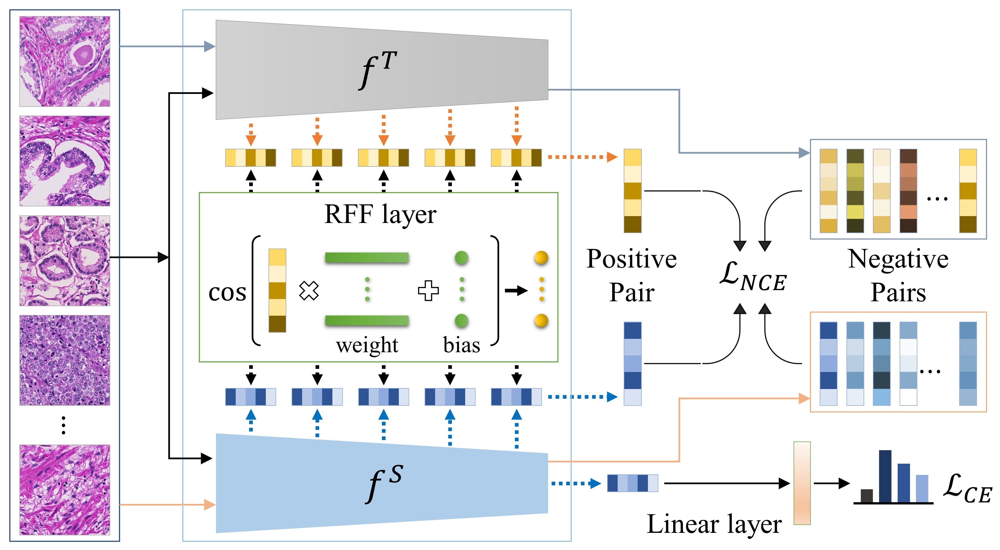

Implementation of paper: 

"Boosting knowledge distillation via random Fourier features for prostate cancer grading in histopathology images"
Trinh Thi Le Vuong and Jin Tae Kwak. 
5th Domain Adaptation and Representation Transfer (DART) - Medical Image Computing and Computer-Assisted Intervention-MICCAI Workshop, 2023

```

```
<p align="center">
  
</p>


## Snippet of Random Fourier Feature (RFF) layer
```python
import torch
import torch.nn as nn

# Fourier feature mapping
def input_mapping_torch(x, B_w, B_b):
    x_proj = torch.matmul(x, B_w) + B_b
    return torch.cos(x_proj)

# Random Fourier Feature (RFF) layer
class RFF_2pi_1WB(nn.Module):
    def __init__(self, out_dim=10, w_scale=10., b_scale=1., b_init='uniform', RFF_init='gauss01',
                  ):
        super(RFF_2pi_1WB, self).__init__()
        self.w_scale = w_scale
        self.b_scale = b_scale
        self.b_init = b_init
        self.out_dim = out_dim
        self.RFF_init = RFF_init

    def forward(self, x, xt):
        x = x.flatten(start_dim=1)
        xt = xt.flatten(start_dim=1)

        #self.RFF_init == 'gauss01
        B_w = torch.empty((x.shape[-1], self.out_dim)).normal_(mean=0, std=1).cuda()
        # b_init = uniform
        B_b = torch.distributions.uniform.Uniform(0, 6.283).sample([1, self.out_dim]).cuda()

        B_w *= self.w_scale
        B_b *= self.b_scale

        out = input_mapping_torch(x, B_w, B_b)
        out_t = input_mapping_torch(xt, B_w, B_b)
        return out, out_t
```

## Train the teacher network (optional)
 
```
python train_teacher.py \
 --dataset 'PANDA' 
```


## Train the student network

```
python train_student.py \
 --dataset 'prostate_hv' \
 --method KD_CoRFF \
 --tec_pre 'PANDA' \
 --std_pre 'PANDA' \
 --loss_st NCE \
 --NCE_weight 1e-4 

```

## Inference on independent dataset (optional)

```
python inference.py \
 --dataset 'prostate_kbsmc' \
 --ckpt ./save/ckpt.pth\
```
<<<<<<< HEAD
# KD_CoRFF
=======
>>>>>>> 174d467 (Initial commit)
